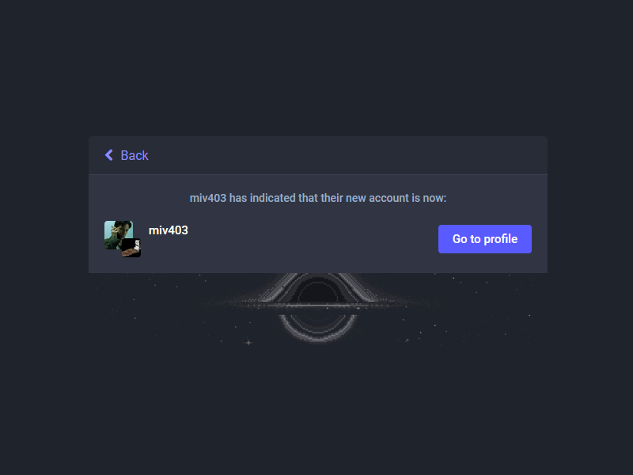

# bir mastodon hesabı nasıl taşınır?

> bu rehber bir mastodon hesabını başka bir mastodon hesabına nasıl taşıyabileceğiniz ve yönlendirebileceğinizi göstermeyi amaçlamaktadır.

## neler taşınabilir?

- takipçiler
- takip edilenler
- engellenen kişiler
- susturulan hesaplar
- yer imleri

## neler taşınamaz?

gönderilerinizi taşıyamazsınız ama hesabınızın arşivini isteyerek dışarı aktarabilirsiniz. indirdiğiniz ``.tar.gz`` uzantılı arşiv dosyasının içinde ``outbox.csv`` adlı dosyada tüm iletilerinizi (tootlar ve doğrudan mesajlar) bulabilirsiniz. ayrıca hesabınıza ait diğer tüm veriler arşiv dosyasının içinde mevcuttur.

isterseniz taşımadan önce eski hesabınızdaki gönderileri yeniden paylaşarak (boostlayarak) yeni hesabınızda gözükmesini sağlayabilirsiniz.

### 1. taşınmak istediğiniz sunucuda hesap açın

taşınmak istediğiniz sunucuya karar verdikten sonra o sunucuda bir hesap açın. daha önce açtığınız hesabı açmaktan hiçbir farkı yoktur. unutmayın, bu açtığınız hesap önceki hesabınızdan tamamen farklı bir hesap. kullanıcı adını aynı seçseniz bile verileriniz başka bir sunucuda tutulacak ve erişeceğiniz adres farklı olacak.

> eskihesabim@eski.mastodon → yenihesabim@yeni.mastodon

> eğer eski kullandığınız kullanıcı adı müsait ise aynı adı da alabilirsiniz:
> favoritakmaismim@eski.mastodon → favoritakmaismim@yeni.mastodon

### 2. hesap takma adı oluşturma

yeni hesabınıza bir tarayıcı üzerinden giriş yapın. ``hesap`` sekmesini ve altındaki ``hesap ayarları`` sekmesini bulun. sayfanın aşağısındaki ``farklı bir hesaptan taşınma`` başlığı altındaki bağlantıya tıklayın.

buraya **eski hesabınız**ın kullanıcı adını girin ve ``takma ad oluştur`` adlı düğmeye tıklayın.

> kutucuğa ``eskihesabim@eski.mastodon`` kullanıcı adınızı girmeniz gerekiyor.

### 3. verileri dışa aktarma

tarayıcınızdan taşınacak/yönlendirilecek olan (yani **eski hesabınız**) hesaba giriş yapın, ayarlar kısmına girin. ``içe ve dışa aktar`` adlı sekmeye ve sonra ``veriyi dışa aktar`` sekmesine tıklayın. takip edilen yazan satırın sonundaki ``csv`` düğmesine tıklayın ve ``following_accounts.csv`` adlı dosyayı kaydedin. bu dosya takip ettiğiniz kişilerin listesini içerir, yerini unutmayın ileride lazım olacak. 

dilerseniz seçeneklerdeki diğer verilerinizi de indirerek yeni hesabınıza aynı yöntemle aktarabilirsiniz.

> işaretli olan csv yazısına tıklayın ve takip edilenler listesini indirin.

### 4. eski hesabınızı yeni hesaba yönlendirme

**eski hesabınız**a bir tarayıcı üzerinden giriş yapın ve ayarları açın. hesap sekmesi altındaki hesap ayarları sekmesini açın. sayfanın aşağısındaki ``farklı bir hesaba taşıyın`` adlı başlığın altındaki bağlantıya tıklayın.

isterseniz uyarıları tekrar okuyup işlemi yapmak isteyip istemediğinizden emin olabilirsiniz.

buradaki kutucuklara **yeni hesabınızın kullanıcı adı**nı ve **eski hesabınızın parolası**nı girin. ``takipçileri taşı`` düğmesine tıkladıktan sonra tüm takipçileriniz yeni hesabınıza yönlendirilecek.

bu işlem uzun sürebilir. nihayetinde tüm takipçileriniz herhangi bir bildirim almadan yeni hesabınızı takip ediyor olacak.

> kutucuğa ``yenihesabim@yeni.mastodon`` kullanıcı adını ve ``eskihesabim@eski.mastodon`` adlı hesaba ait parolayı girmelisiniz.

nihayetinde eski profilinizde başka bir profile yönlendirildiğine dair bir bilgilendirme mesajı ve eski hesabınıza giriş yaptığınızda sizi ayarlar kısmına yönlendiriyor olması gerekiyor.

bu, işlemleri başarıyla yaptığınız anlamına gelir. takipçilerinizin tamamı biraz zaman sonra yeni hesabınıza aktarılmış olacaktır. 

### 5. takip edilenleri aktarma

yeni hesabınıza giriş yapın ve ayarları açın. ``içe ve dışa aktar`` sekmesinin altındaki ``içe aktar`` sekmesini açın.

``takip edilenler listesi`` seçeneğini işaretleyin. ``gözat`` düğmesine basıp daha önce indirmiş olduğunuz ``following_accounts.csv`` adlı dosyayı seçin. sonra ``yükle`` düğmesine tıklayın. bu işlemin sonunda eski hesabınızda takip ettiğiniz kişileri yeni hesabınızda da takip ediyor olacaksınız

bu menü içerisinden [üçüncü maddede](README.md#3-verileri-dışa-aktarma) dışa aktardığınız diğer verileri de aktarabilirsiniz. içeri aktarma türü altındaki açılır listeden istediğiniz seçeneği işaretleyip ilgili veriyi yüklemeniz yeterli.

***

görseller [GIMP](https://www.gimp.org) ile düzenlenmiştir.

ingilizce resmi rehber için [bu adresi](https://docs.joinmastodon.org/user/moving/) ziyaret edebilirsiniz.

sorularınız varsa [@miv403@defcon.social](https://defcon.social/@miv403) ve [miv403@duck.com](mailto:miv403@duck.com) adresleri üzerinden iletişime geçebilirsiniz.

> bu rehber resmi ingilizce rehber temel alınarak miv403 tarafından yazılmıştır. herhangi bir çeviri yoktur.